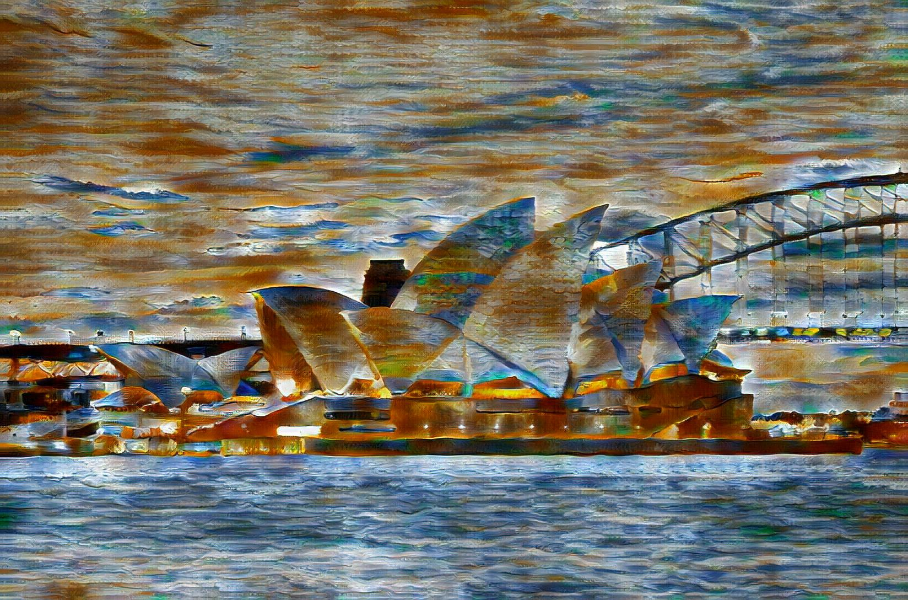
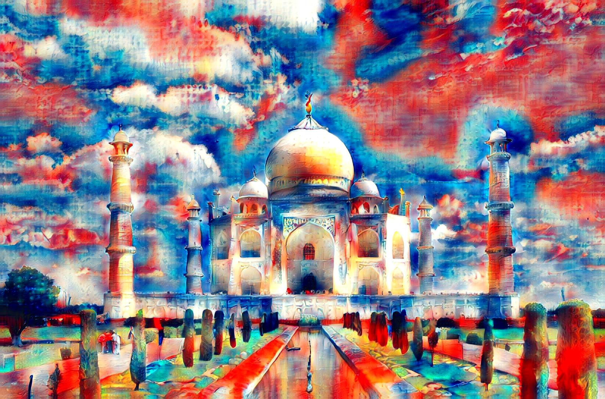
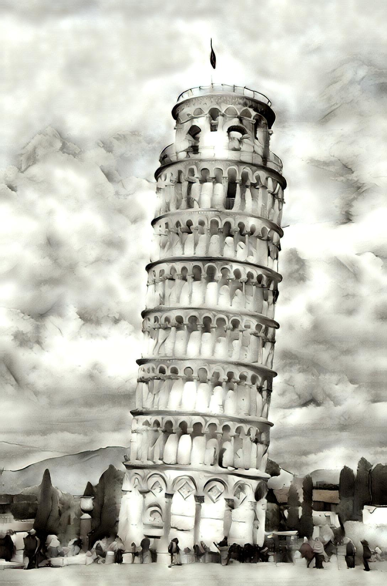

# Attributions
## The images in this press kit include these images licenced under a Creative Commons ShareAlike licence:

<!--["Tour Eiffel Wikimedia Commons (cropped)"](https://commons.wikimedia.org/wiki/File:Tour_Eiffel_Wikimedia_Commons_(cropped).jpg) by [Benh LIEU SONG](https://commons.wikimedia.org/wiki/User:Benh), licenced under [CC BY-SA 3.0](https://creativecommons.org/licenses/by-sa/3.0/deed.en)-->

["The Leaning Tower of Pisa SB"](https://commons.wikimedia.org/wiki/File:The_Leaning_Tower_of_Pisa_SB.jpeg) by [Saffron Blaze](http://www.mackenzie.co/), licenced under [CC BY-SA 3.0](https://creativecommons.org/licenses/by-sa/3.0/deed.en)

["Sydney Opera House, botanic gardens 1"](https://commons.wikimedia.org/wiki/File:Sydney_Opera_House,_botanic_gardens_1.jpg) by [Adam.J.W.C.](https://commons.wikimedia.org/wiki/User:Adam.J.W.C.), licenced under [CC BY-SA 2.5](https://creativecommons.org/licenses/by-sa/2.5/deed.en)

["Lady Liberty under a blue sky (cropped)"](https://commons.wikimedia.org/wiki/File:Lady_Liberty_under_a_blue_sky_(cropped).jpg) by [User:Mcj1800 (unknown author)](https://commons.wikimedia.org/w/index.php?title=User:Mcj1800&action=edit&redlink=1), licenced under [CC BY-SA 4.0](https://creativecommons.org/licenses/by-sa/4.0/deed.en)

["Taj Mahal (Edited)"](https://commons.wikimedia.org/wiki/File:Taj_Mahal_(Edited).jpeg) by [Yann Forget](https://commons.wikimedia.org/wiki/User:Yann), edited by [Jim Carter](https://commons.wikimedia.org/wiki/User:Jim_Carter), licenced under [CC BY-SA 4.0](https://creativecommons.org/licenses/by-sa/4.0/deed.en)

[Colosseum in Rome, Italy - April 2007](https://commons.wikimedia.org/wiki/File:Colosseum_in_Rome,_Italy_-_April_2007.jpg) by [David Iliff](https://commons.wikimedia.org/wiki/User:Diliff), licenced under [CC BY-SA 2.5](https://creativecommons.org/licenses/by-sa/2.5/deed.en)

[Great Wall of China near Jinshanling](https://commons.wikimedia.org/wiki/File:20090529_Great_Wall_8185.jpg) by [Jakub Halun](https://commons.wikimedia.org/wiki/User:Jakubhal), licenced under [CC BY-SA 3.0](https://creativecommons.org/licenses/by-sa/3.0/deed.en)

## As they are derivative works, the following images are licenced under the compatible [CC BY-SA 4.0](https://creativecommons.org/licenses/by-sa/4.0/deed.en) licence:

{: .small}

[Link](assets/images/imageset1/greatwall_viewfromthedunes.jpg)

{: .small}

[Link](assets/images/imageset1/statueofliberty_seatednude.jpg)

{: .small}

[Link](assets/images/imageset1/towerofpisa_wheatfieldwithcyprus.jpg)

{: .small}

[Link](assets/images/imageset1/colosseum_starrynightovertherhone.jpg)

{: .small}

[Link](assets/images/gallery/sydneyoperahouse_viewfromthedunes.jpg)

{: .small}

[Link](assets/images/gallery/tajmahal_abstractpainting.jpg)

{: .small}

[Link](assets/images/gallery/towerofpisa_rooftopsandtree.jpg)

## If you would like to use any other images, please [contact us](/infusion/media#contact) or [download the press kit](infusion/assets/files/press-kit.zip).