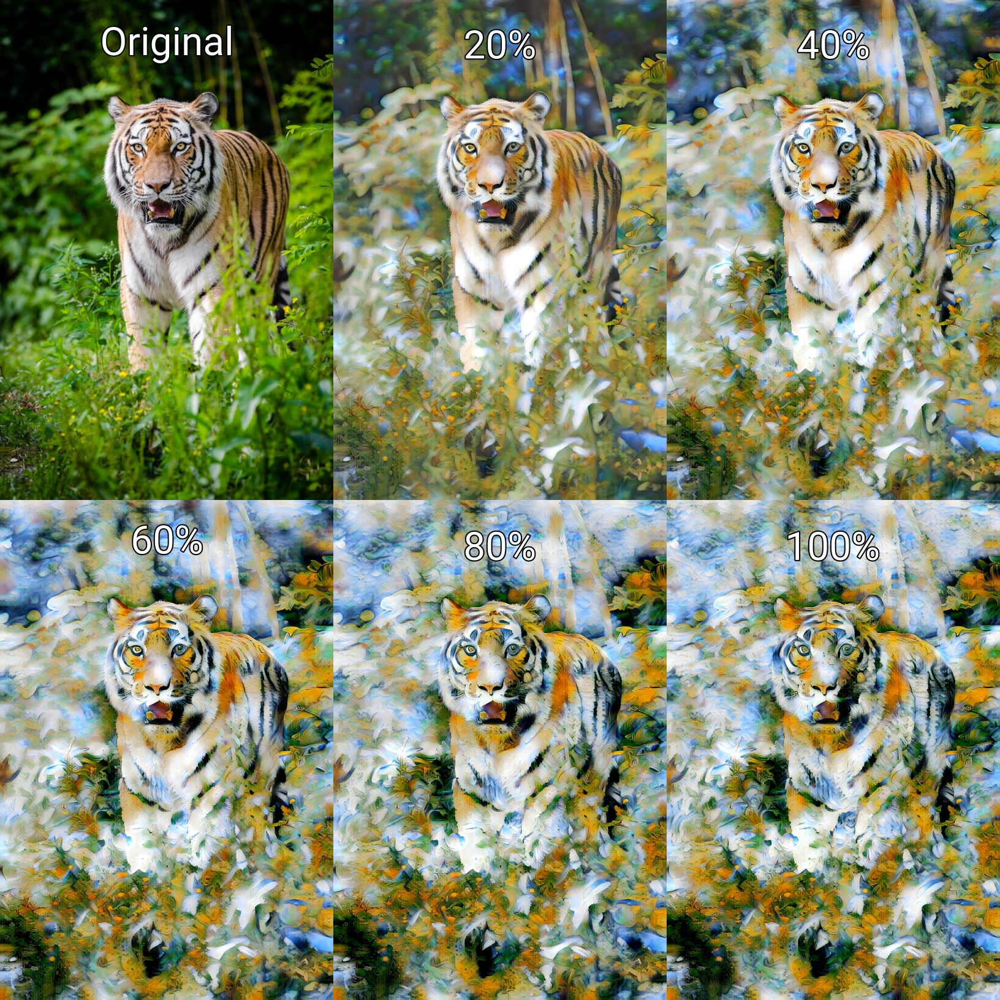

# Advanced Features
The Advanced tab houses the Stylisation Strength slider as well as depth layer adjustment features.

## Stylisation Strength
The stylisation strength slider, as the name implies, controls how strong the stylisation is. A lower stylisation strength results in an image more similar to the original image, while a higher stylisation strength results in an image that is more strongly styled.

The stylisation strength slider does not simply blend the original photo and the output artwork together. Instead, it deeply affects the neural network styling process which results in a much more convincing output.

## Depth Layers
Depth layers adjustments are features only available to users with a Pro subscription. They allow very fine control over the neural style transfer process which can be used creatively in a number of ways by an experienced user of Infusion. For more information on depth layers, please check the [depth layer sections](/infusion/manual/depth-layers-basics.html) in this manual.