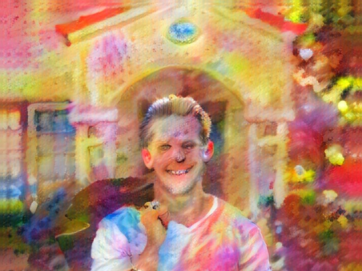
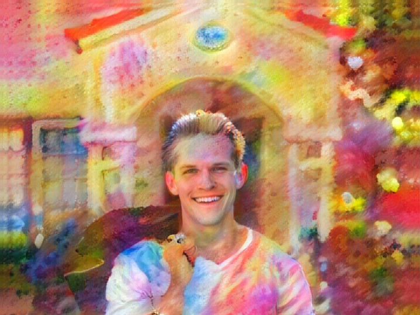
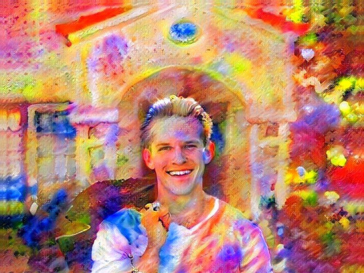
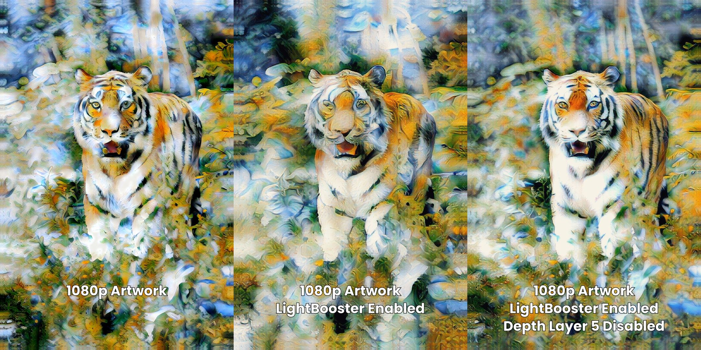
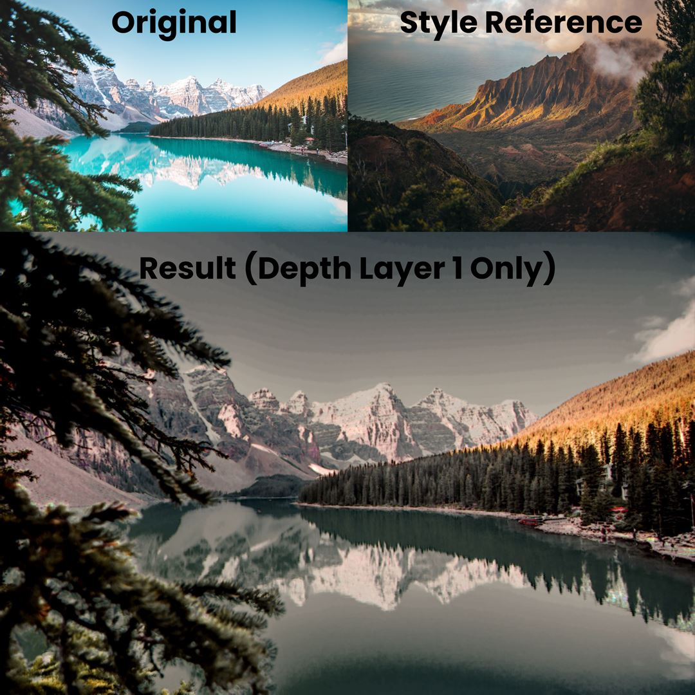

# Infusion Pro: Depth Layers Advanced
The flexibility of depth layers allows many advanced operations to make full use of Infusion’s neural style transfer engine. In this section, you will learn how to use depth layers to achieve a variety of different effects with Infusion Pro.

## Manual Face Preservation
Infusion’s intelligent Preserve Faces feature allows you to prevent faces from being distorted during the stylisation process. However, sometimes, it may fail to recognise a face, or it may distort a non-human face, such as an animal’s face, or you may prefer to preserve faces yourself. You can do this with an Infusion Pro subscription.

Recall the processing chain detailed in the Depth Layer Basics section. Note the Preserve Faces layer comes after depth layer 4 and before depth layer 3. This information will allow us to preserve certain details in the original picture.

First, generate the image where you want faces manually preserved, but with depth layers 3, 2 and 1 disabled. Save the output image.

Then, load up your favourite image-editing software. Overlay the original image on top of the generated image – remember to align the top left corners. Then, erase the image with a hardness 0 brush until only the parts you want to preserve remain. Then, set the transparency to 0.8 and blend mode to luminance, although normal blend mode can also work.

Finally, load the image you just obtained with the image-editing software back into Infusion as the content image. Disable depth layers 5 and 4 and render the image. The final artwork should have the details you manually preserved.

## Low-Resolution Artwork Generation
A side effect of increasing the resolution is that more details will be preserved, and vice versa. While generating a low-resolution artwork, or an artwork with LightBooster enabled, you may want to have more details in the final artwork.

Fortunately, depth layers allow you to achieve a similar level of detail. Recall that layers with higher depth control coarser features in the image stylisation process. Simply disable depth layer 5 when you’re generating a low-resolution artwork, and the final result will be more detailed.

## Colour Transfer
Recall that lower depth layers control finer details such as colours in the final artwork. With this in mind, we can effectively modify one image to have the colour pallet of another image.

To do this, load the original image into Infusion as the content image, and the image you’re using as a colour reference into Infusion as the style image. Then, disable all depth layers except for depth layer 1, and generate an artwork.

Quality of images produced with this method may differ. You may need to adjust some parameters to get the optimal result. This method tends to work the most effectively with images depicting similar subject matter.