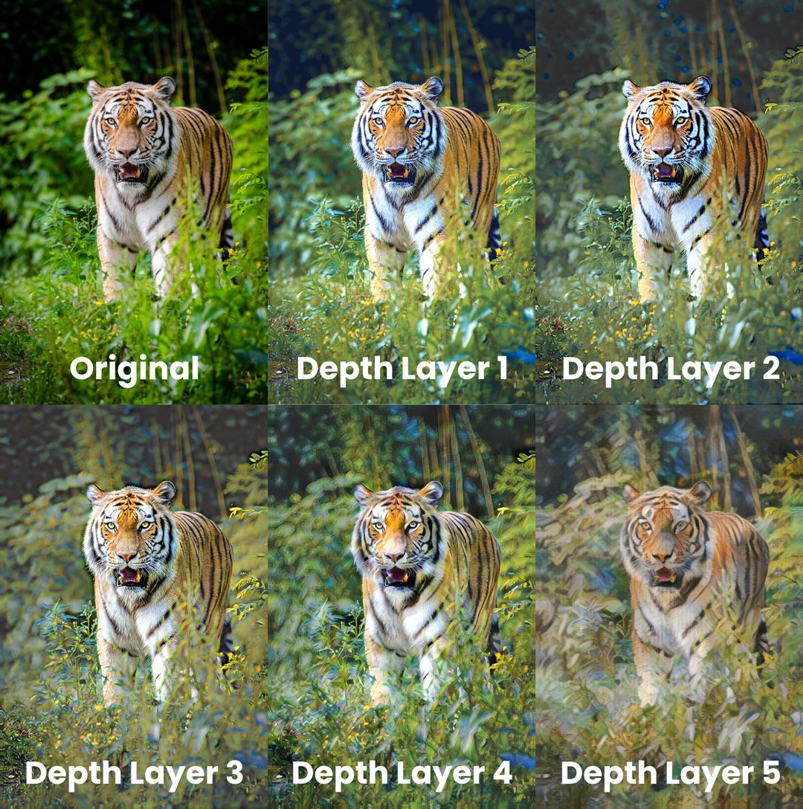
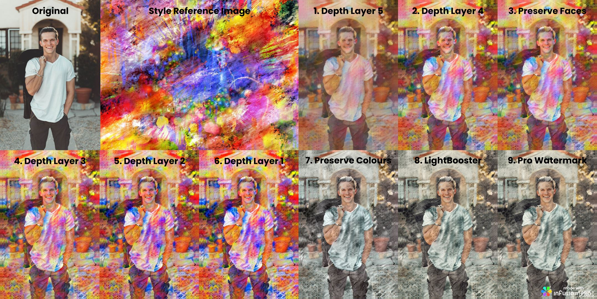
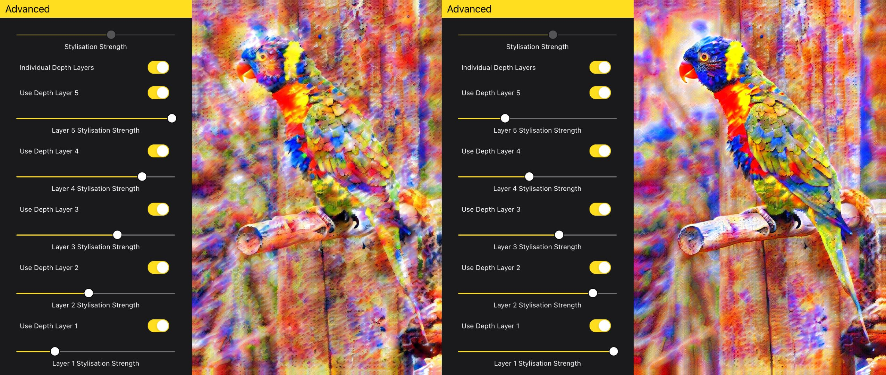

# Infusion Pro: Depth Layers Basics
Depth layers give you fine control over Infusion’s neural style transfer process. From a human-understandable point of view, layers with higher depth control the style transfer for “coarser” features, such as brush strokes and patterns, while layers with lower depth control “finer” features, such as colours.

The graphic below illustrates the individual effects of each depth layer, effectively. When combined, these depth layers work together to create an artwork.

## Processing Chain
The photos made by Infusion are processed in this order:

Input -> Depth Layer 5 -> Depth Layer 4 -> Preserve Faces -> Depth Layer 3 -> Depth Layer 2 -> Depth Layer 1 -> Preserve Colours -> LightBooster -> Pro Watermark

This can be observed in the following graphic:

<i>click to expand</i>

Note that some layers may be disabled depending on the configuration when generating an artwork with Infusion. Overall, it can be seen that Infusion first performs style transfer on the coarser features in an image and gradually works its way down to the finer features before applying post-processing.

As an Infusion Pro user, you can control any element in the processing chain. For example, you can disable Depth Layer 5 to keep more details of the original image when generating an artwork with Infusion. More details can be found in the advanced depth layers section.

## Controls
Each depth layers comes with its own controls. These will be disabled if you do not have an Infusion Pro subscription. However, even with a Pro subscription, these elements will still be greyed out by default.

To enable individual controls over depth layers, scroll to the Advanced tab and turn on the “Depth Layers” toggle. You will then be able to adjust individual depth layer elements. You can choose to disable certain depth layers or adjust the stylisation strength for an individual depth layer, similar to how you would adjust the overall stylisation strength. The figure below shows the difference in result between different depth layer settings.

