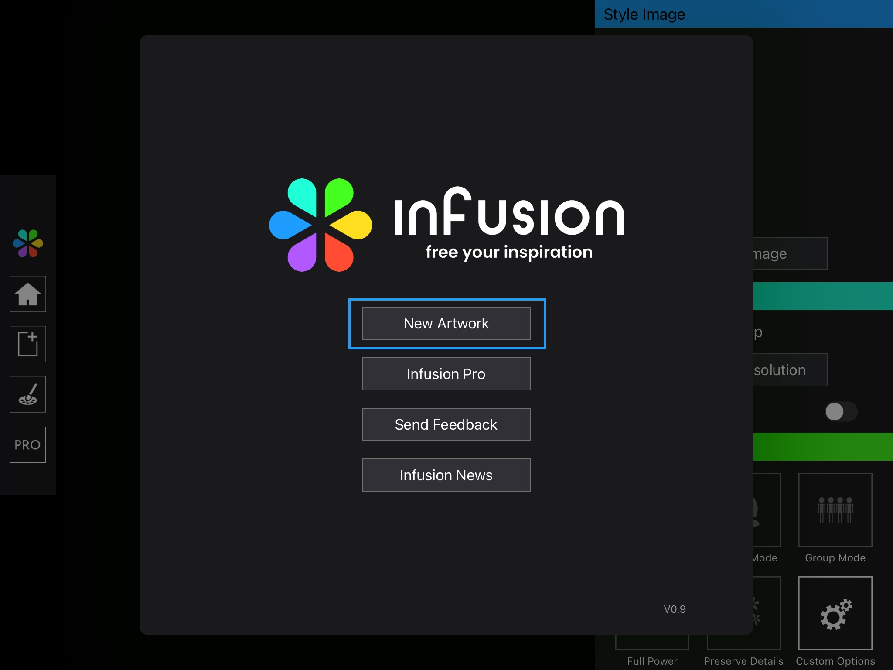
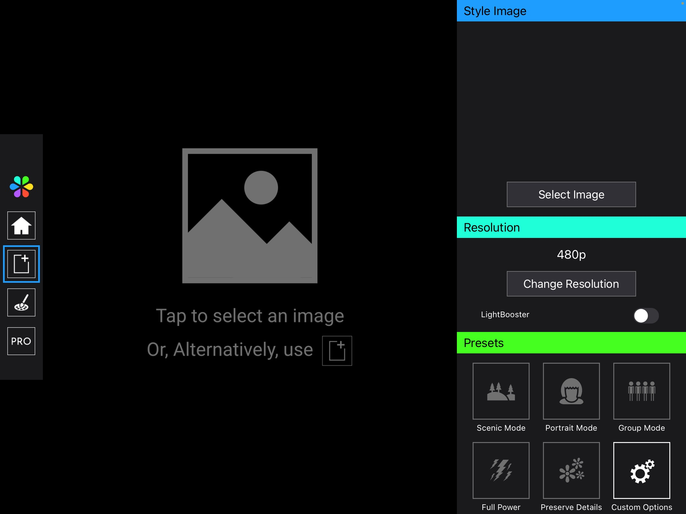
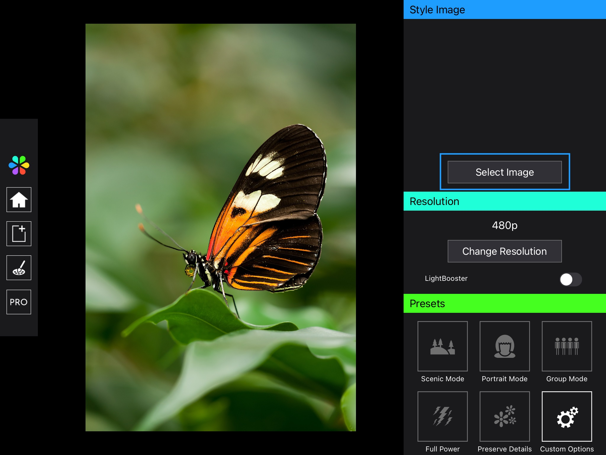
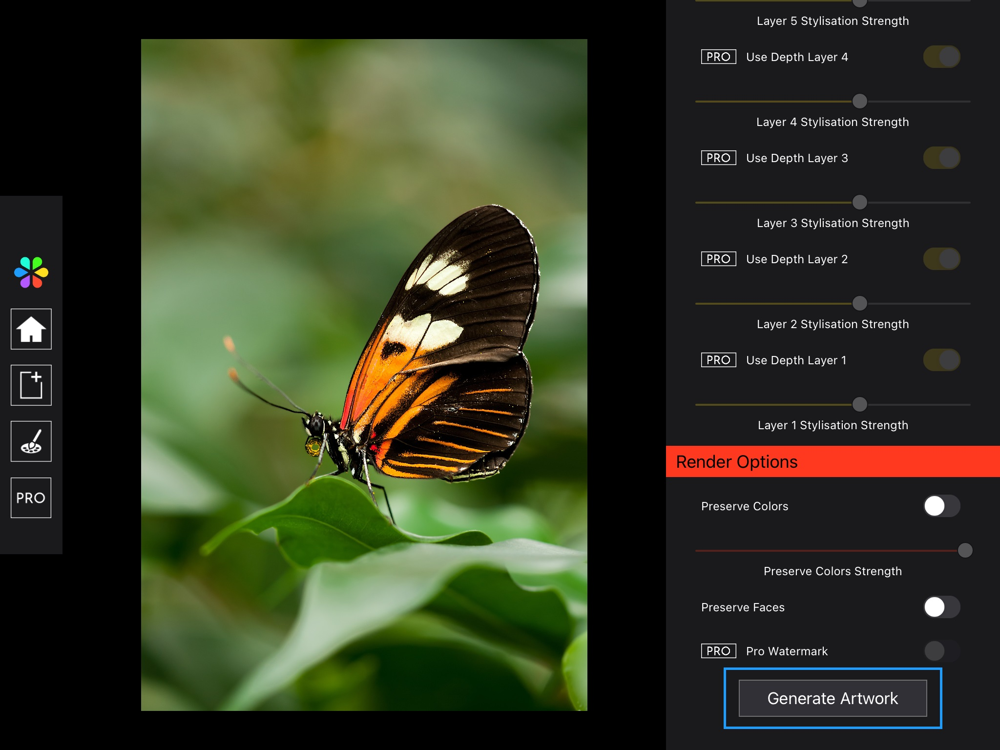
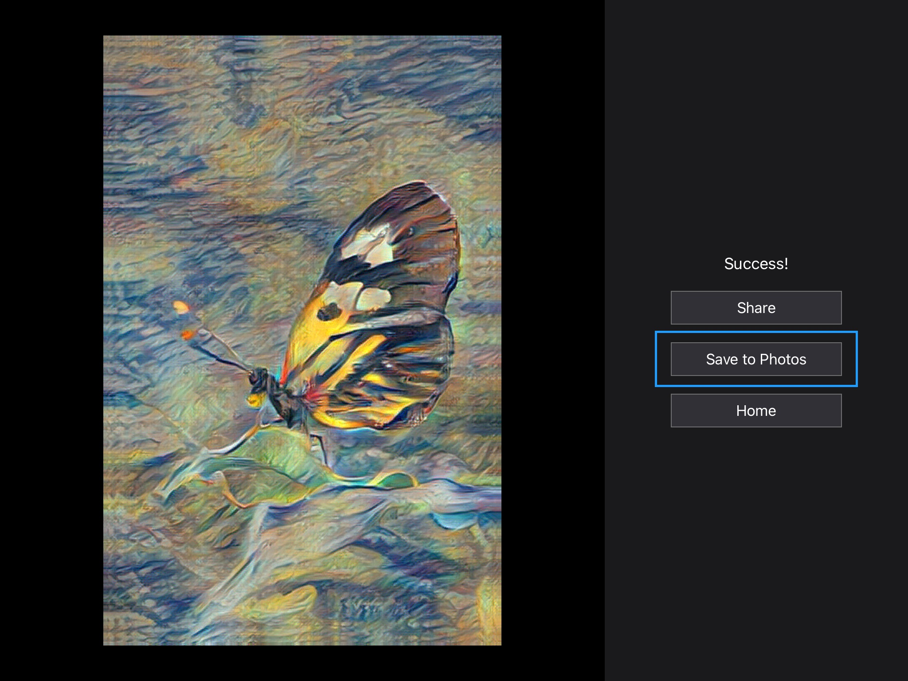

# Getting Started

Welcome to Infusion! In this tutorial, learn how to create stunning artworks with an AI in a few simple steps.

## Create a new artwork

First, dismiss the home menu by selecting the New Artwork button.

## Selecting a content image

Select an image by tapping the prompt or by using the button on the left sidebar, as show in the image below.

You will then be prompted to select an image from your photo library. This image will be displayed on the left; it will form the content of the generated artwork.

## Selecting a style image

On the menu on the right, tap the Select Image button and select Style Bank. Then, tap on any of the images shown.

The style image should now be displayed above the Select Image button. The neural network will use this style image as a reference, and the final artwork will have the artistic style of this image. You can also select a style image from your photo library.

## Render artwork

Scroll the menu on the right to the bottom. Right now, we don’t need to change any settings. Under Render Options, tap the Generate Artwork button, and Infusion will start creating the artwork.

## Save results

After a while, Infusion will finish creating the artwork. You can share the finished artwork or save it to your photo library.

