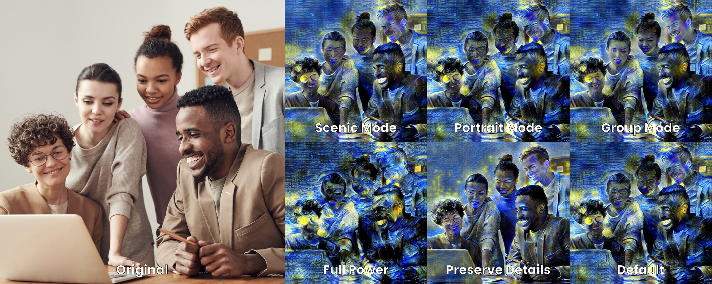

# Presets
The Presets tab in Infusion allows you to quickly select a set of predefined options for Infusion’s neural network, optimised for a specific type of photo content. Infusion has a total of five presets: Scenic Mode, Portrait Mode, Group Mode, Full Power and Preserve Details. To select a preset, simply tap on its image and it will light up.

<i>click to expand</i>

## Custom Options
This is simply the default option, and will also light up if you modify the default values of any other preset.

## Scenic Mode
Scenic Mode allows you to stylise landscapes, such as mountains, lakes, forests and waterfalls. In this preset, the stylisation strength is lowered so finer details in the scenery will be better preserved and the resulting artwork will be more coherent.

## Portrait Mode
Portrait Mode is a stylisation mode designed for photos with a single human subject as a focus. In Portrait Mode, facial preservation is turned on for the largest face in the image, which prevents facial features from being distorted. Unlike Group Mode, only the largest face in the picture gets preserved, which when stylising a portrait with people in the background.

## Group Mode
Group mode allows you to stylise photos with multiple people. Facial preservation is turned on for all faces in Group Mode, preserving fine facial details. Compared to Portrait Mode, the stylisation strength is turned down slightly to better preserve the smaller faces in a group photo.

## Full Power
The Full Power mode is for when you do not care about the details of your content image and you would like an abstract artwork as the output. In the Full Power mode, stylisation strength is turned up to the max, leading to a heavily-styled output.

## Preserve Details
Preserve Details can be thought of as the opposite of Full Power: in Preserve Details, stylisation strength is decreased, and depth layer 5 is turned off. You can find out more about depth layers in the Depth Layers section of the manual. This turns down the stylisation and results in more details in the original content image being preserved in the final artwork, which is useful when doing small renders, or when normal stylisation is producing artworks that are too heavily distorted.

Please note that while depth layer adjustments are a Pro feature, the Preserve Details feature is available to all users for free.