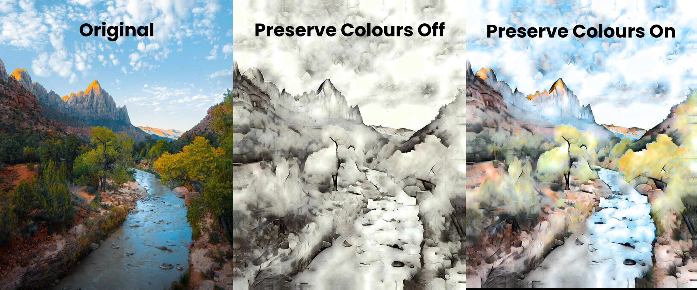
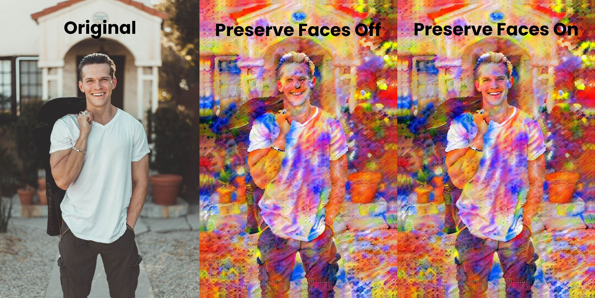
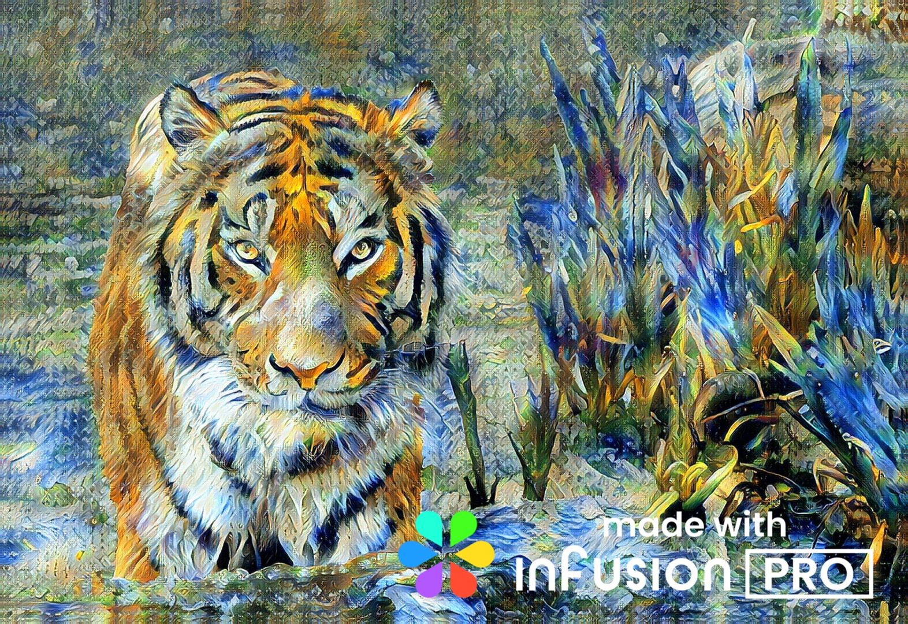

# Render Options
The Render Options tab contains a number of options which allow you to change how the artwork will be created by Infusion. These options may change the final generated artwork significantly and is the perfect section to explore if you’re looking to experiment with big changes.

## Preserve Colours
Whether to preserve colours is controlled by a switch or checkbox which is off by default, and the strength of the preserve colours option is controlled by a slider. As the name implies, turning preserve colours on means that the final generated artwork will retain the colours of the original image. With certain style reference images, the output artwork can heavily resemble a watercolour painting.

The preserve colours strength slider controls how much of the original image’s colours will be preserved. Usually, it is sufficient to leave it at max, which is the default.

## Preserve Faces
The preserve faces option automatically detects all human faces the input image and ensures that they are not distorted by the neural style transfer process. This ensures that faces will be clearly distinguishable in the output artwork.

## Pro Watermark
Pro Watermark adds a watermark saying “made with Infusion Pro” to your photos, you know, so that everyone knows you’re rich.

