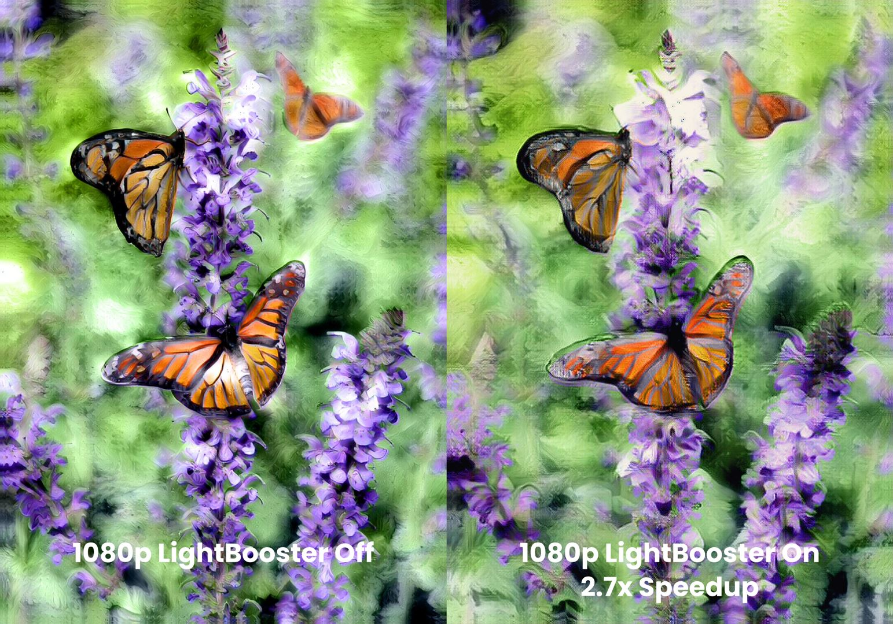

# Resolution

The Resolution tab allows you to change the resolution of the artwork created by Infusion.

## Change Resolution

Use the Change Resolution button to change the resolution. Usually, you will see a list consisting of “480p”, “720p HD”, “1080p HD”, 1440p 2K” and “2160p 4K”. Some options may be missing depending on the model of your phone or tablet.

Please note that these resolutions only apply if the aspect ratio of your content image is 16:9 or lower. If the aspect ratio is greater than 16:9, then the actual length of the shorter side of the output image may be lower than the resolution stated.

Increasing the resolution also causes more details of the original image to be preserved, as observed below. This is useful when you need the final output to be more detailed.

## LightBooster

LightBooster is Infusion’s exclusive deep learning super sampling technology which gets you high-resolution images more quickly. When LightBooster is turned on, Infusion first generates an artwork at half the requested resolution. Then, the image passes through the LightBooster neural network, which doubles the artwork’s dimensions without compromising on image quality.

Sometimes, when the resolution is set too high for your device, the LightBooster option will turn on and be greyed out. This is because the resolution is too high for your device to generate artworks without crashing, and LightBooster allows you to get the desired resolution without crashing your device.