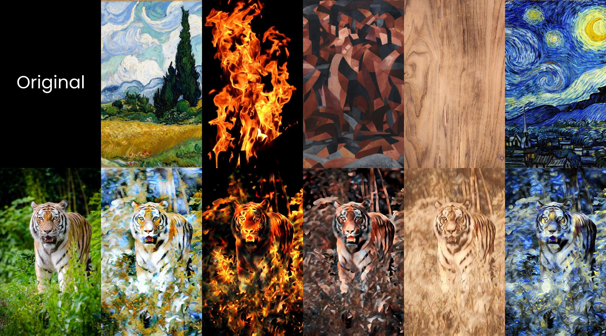
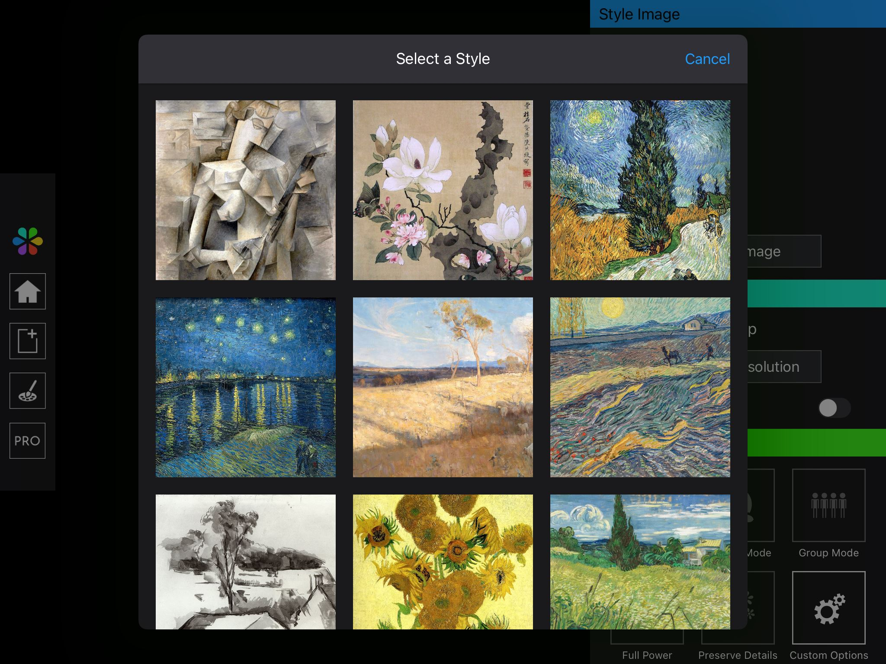
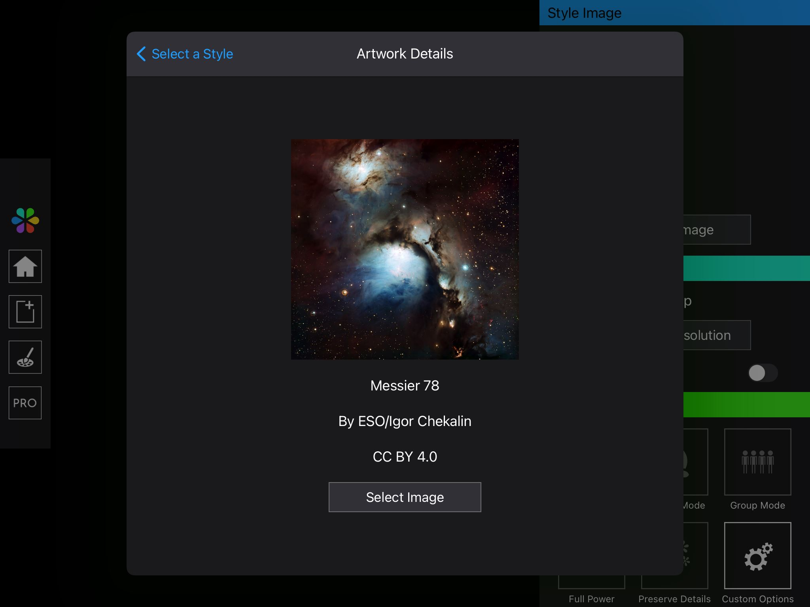

# Style Image
The Style Image tab provides options to adjust the style reference image for Infusion's neural network.

## Style Reference Image
The below image illustrates the effect of using different style reference images on the final generated artwork. The generated artwork will have the artistic style of your selected style reference image, regardless of whether it is a conventional artwork or something more abstract like a picture of flames.

## Style Bank - Advanced Features
In Infusion, you can select any image as the style reference image, even photos from your own photo library. However, you can also choose to get started using preselected image from the Infusion Style Bank. To access the Style Bank, simply choose the Style Bank option when selecting a style image.

The style bank displays images in a grid view. To select any of the images as the style reference image, simply tap on it.

Alternatively, you can long-press any image in the grid view to find more about its details. This will display the artwork title, the author's name and the licence (if applicable). You can tap on the artwork title, the author's name or the licence to find out more.

